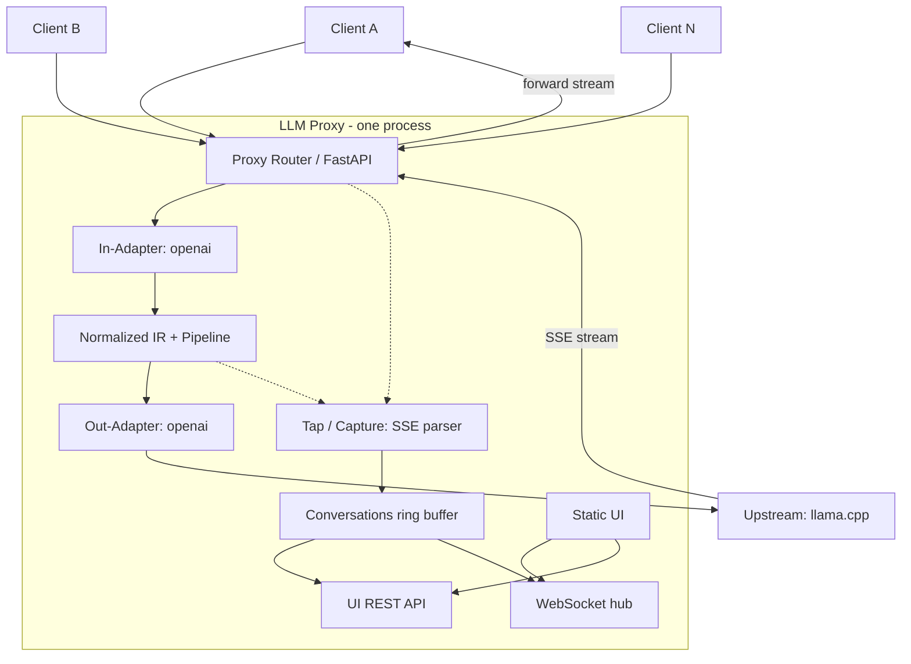
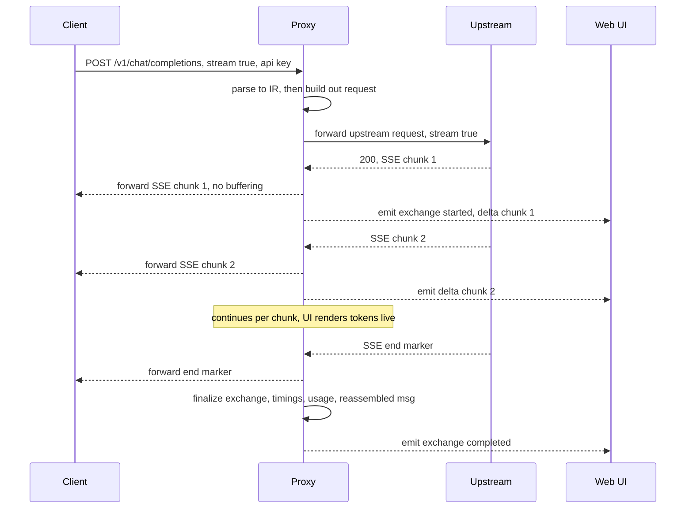

# LLM Proxy — Build Plan

> A lightweight, low-overhead, OpenAI-API-compatible proxy with a live "conversation" Web UI for inspecting, replaying, and exporting client↔server traffic.
>
> Status: **Draft for review.** Recommended defaults are stated inline; items needing a decision are marked **`[OPEN]`** and collected in §13.

---

## 1. Goals

1. Proxy OpenAI-API-compatible calls from **multiple clients** to an OpenAI-API-compatible upstream server.
2. A **Web UI** showing live API transactions as a **conversation view** (prompt → response), with full debug info (raw headers, bodies, status, timings). Each message is **expandable** to show the entire wire call.
3. **Each client gets its own conversation tab** (left-hand dock lists clients/conversations; main pane shows the selected one).
4. **Replay** any captured request to the upstream and append the result to the conversation.
5. **Export** a conversation as a structured **JSON dump**.
6. Ship as a **Docker container, single image** (Dockerfile + example `docker-compose.yml`).
7. **Performant** — no significant added latency/overhead between client and server.
8. **Pluggable I/O adapters** (modules) so input and output API formats can be swapped **independently** (e.g. OpenAI in → Anthropic out) in the future.
9. Show **timestamps and time deltas** (TTFT, total, inter-token) in the conversation view.

### Non-goals (v1)

- Not a general-purpose mitmproxy / TLS-intercepting man-in-the-middle for arbitrary TLS clients (see §10 for how we stay on the "API proxy" side of that line).
- Not a multi-upstream load balancer / router in v1 (single upstream; routing is a roadmap item).
- Not a full feature-clone of any existing tool; it borrows the *vibe* (mitmproxy + Llama.cpp WebUI).

---

## 2. Key Decisions (with rationale)

| Decision | Choice | Rationale |
|---|---|---|
| Language / runtime | **Python 3.12, async (`asyncio`)** | User's home language. Traffic is I/O-bound (LLM latency dominates), so async Python adds negligible overhead while keeping iteration fast. Avoids the dev-speed cost of Rust/Go for a tool where raw CPU is not the bottleneck. |
| HTTP framework | **FastAPI + Uvicorn** (Starlette core) | Async-native, serves the proxy API, UI static files, REST, and WebSocket from one process/port. `uvloop` optional. |
| Upstream client | **`httpx2` (async, connection-pooled, HTTP/1.1 + keep-alive, streaming)** | First-class async streaming (`aiter_*`), connection reuse, clean timeout control. |
| Live UI transport | **WebSocket** (`/ws`) | One persistent, low-overhead channel for live token/exchange events. Better than polling; simpler than SSE for bidirectional (replay, selection) control. |
| Frontend | **No-build single-page app** (vanilla JS, optional Preact) served as static files | Keeps the Docker image **single-stage & small** (no Node build), trivially maintainable. (Q6 decided — see §13.1.) |
| Client identity | **Source IP (primary) + optional API key as a secondary tag**; no key required by default | Trusted LAN; IP is stable and zero-config. An optional key lets two apps behind one IP/NAT get separate tabs. See §5.1 + the Docker source-IP note. |
| Streaming | **Tap-and-forward SSE** | Forward upstream SSE bytes to the client in real time (no full buffering) while tapping deltas to the UI. This is the core of both performance and the live view. |
| I/O model | **Adapter/Plugin protocol + Normalized IR** | Independent in/out formats; v1 ships OpenAI↔OpenAI passthrough. |
| Storage | **In-memory ring buffers** (+ optional on-disk JSON persistence) | Live tool first; persistence is opt-in. |
| Testing | **`python -m unittest`** (stdlib) — one framework, no runner deps | Zero extra dependencies, consistent with the lean/low-overhead ethos. The suite is small (a handful of e2e + unit tests) and unittest is sufficient; `python -m unittest discover` needs no runner config. Migrate to pytest only if the suite grows and needs fixtures/parametrize. |

---

## 3. Architecture

### 3.1 High-level diagram



The tap (dotted arrows) sits on **two** points: the normalized request (from `IR`) and the **live SSE response stream** as `P` forwards it back to the client. That is the "tap-and-forward" — each chunk is passed to the client untouched while simultaneously being parsed and accumulated by `CAP`.

### 3.2 Components

- **Proxy Router** — owns the FastAPI app. Routes:
  - `POST /v1/*` (configurable OpenAI path allowlist) → proxy pipeline.
  - `GET /` + static assets → Web UI.
  - `GET /api/*` → UI data API (conversations, exchanges, replay, export).
  - `WS /ws` → live event hub.
  - `GET /health` → liveness.
- **In-Adapter / Out-Adapter** — pluggable format codecs (see §6). v1: `openai`.
- **Normalized IR + Request Pipeline** — canonical representation; the place where routing/transform hooks (future) attach.
- **Capture / Tap** — for each exchange, records raw wire request + raw wire response, parsed fields, and timing metrics; for streams, parses SSE deltas and accumulates the reassembled message. Emits events to the hub.
- **Store** — per-client conversation = bounded ring buffer of exchanges (configurable size/age). Thread-agnostic (single event loop → no locks needed on the hot path).
- **WebSocket hub** — fans out events (new exchange, token delta, replay, error) to subscribed UI clients.
- **UI** — single-page app: left dock (client/conversation list), main pane (conversation), transport over `/ws`.

### 3.3 Data flow (streaming, the important case)



Non-streaming responses follow the same pipeline minus the per-chunk fan-out (one `exchange_completed` with the full body).

---

## 4. Data Model

```
Client
  id          (source IP, or "ip::key" when a key is sent; CLIENT_ID_HEADER fallback)
  name        (human label; auto or from key mapping)
  first_seen, last_seen

Conversation          (v1: one per client IP by default; optionally auto-split by message history)
  id
  client_id        (IP, or "ip::key")
  tag              ("" by default; set when auto-split opens a new conversation)
  created_at
  exchanges: [Exchange]   (ring buffer, bounded)

Exchange
  id
  sequence          (monotonic per conversation)
  is_replay
  client_request:   { timestamp, method, path, headers, body_json, size_bytes }
  server_response:  { timestamp, status, headers, body_json | {stream:true, chunks:[], reassembled}, size_bytes }
  timings:          { t_request_in, t_response_first_byte(TTFT), t_response_end,
                      total_ms, ttft_ms, per_token_ms(≈), tokens, tokens_per_sec }
  usage:            { prompt_tokens, completion_tokens, total_tokens }   (if upstream provides)
  error:            { type, message } | null

Event (WS payload)
  { type: exchange_started | delta | exchange_completed | replay | error | client_seen,
    conversation_id, exchange_id, payload }
```

**Splitting multiple conversations from one machine (no API key needed).** By default a client IP maps to a single conversation tab. If one machine runs more than one logical chat, conversations can be auto-split **without any key or client config** by detecting boundaries from the request's `messages` history (OpenAI chat is stateless — the client re-sends the full history each turn):
- A request **continues** the current conversation when its `messages` starts with the same first message **and** its length is ≥ the previous request's (history is being echoed back / grown).
- Otherwise it **starts a new conversation** (history reset or a different first message — a fresh chat or a one-shot prompt).
This is opt-in via `SPLIT_CONVERSATIONS=history` (**off by default** = one tab per IP). It's a heuristic: it cleanly groups multi-turn chats and separates fresh/one-shot prompts, but two *interleaved* apps on one IP can still be ambiguous. For explicit control, an optional `X-Conversation-Id` header (no key required) can force the `tag`.

**Retention:** per-client ring buffer capped by `RETENTION_MAX_EXCHANGES` and `RETENTION_MAX_AGE`. Eviction is lazy (on append) and cheap. Persistence is **in-memory only for now**; SQLite is a roadmap option (Q5).

---

## 5. API Surface

### 5.1 Proxy API (client → proxy)
- `POST /v1/chat/completions` — primary.
- `POST /v1/completions`, `POST /v1/embeddings`, `GET /v1/models`, and (configurable) `/v1/audio/*` — passthrough.
- **Client identification (drives the conversation tab):** `client_id` = the request's **source IP**, optionally suffixed with the **API key** if the client sends one → `"<ip>"` or `"<ip>::<key>"`. **No key is required** — a plain client is identified by IP alone. The optional key is an *identifier* (to split tabs), not a security credential, so two apps behind the same IP/NAT get separate conversations. A `CLIENT_ID_HEADER` (e.g. `X-Client-Id`) can be used as an explicit fallback when the real IP isn't visible (see Docker note).
- **Transparent forwarding:** the proxy forwards the request **body and headers unchanged** (it only rewrites what it must — routing/`Host` to reach the upstream, and connection/hop-by-hop management). The goal is a near-invisible hop: the upstream should not be able to tell it is behind the proxy.
- **Auth pass-through (the key point):** the client's `Authorization` / API-key header is **forwarded to the upstream as-is** — never rewritten or replaced. The client's auth relationship with the upstream is preserved end-to-end.
  - *Fallback only:* if the client sends **no** key and `UPSTREAM_API_KEY` is configured, the proxy injects that server-side key (convenience for upstreams that require a key while some clients omit one). If neither is present, no auth header is sent.
  - When a client does send a key, it also serves as the secondary conversation-tab identifier (see above).
- **Path allowlist** is configurable so non-OpenAI paths fall through to the UI.

> **Client source IP under Docker.** On **Linux**, published ports are normally handled by **iptables DNAT**, which rewrites only the destination — so a service behind `ports:` **does see the real client source IP**. No special networking is required; plain `ports:` is sufficient for IP-based identification. Two caveats:
> - If your Docker daemon routes published ports through the **userland proxy** (`docker-proxy`) instead of DNAT, the source IP can appear as the bridge IP (e.g. `172.17.0.1`). Fix by disabling the userland proxy (daemon `userland-proxy: false`) or, if you prefer, using `network_mode: host`.
> - On **Docker Desktop (macOS/Windows)** the real client IP is not visible (you see the VM's NAT IP).
> In either degraded case, set `CLIENT_ID_HEADER` and have clients send it, or accept per-host IP granularity.
>
> **MAC address** is deliberately *not* the identity key: the HTTP/ASGI layer only exposes the IP, and MACs aren't reliable across switches/NAT. If MAC capture is ever wanted it's a best-effort OS-level enrichment, not the stable key.

### 5.2 UI REST API (`/api/...`)
- `GET  /api/clients` — list clients/conversations (for the dock).
- `GET  /api/conversations/{id}` — full conversation (paginated).
- `GET  /api/conversations/{id}/exchanges/{seq}` — one exchange (full debug).
- `POST /api/conversations/{id}/exchanges/{seq}/replay` — re-send the captured **client request** for exchange `{seq}` to the upstream (body: optional overrides, e.g. `model`, edited body). Returns/creates a new exchange flagged `is_replay`.
- `GET  /api/conversations/{id}/export?format=json` — download dump (§7).
- `DELETE /api/conversations/{id}` — clear a conversation.

### 5.3 WebSocket protocol (`/ws`)
- Server → UI: JSON events from the `Event` model above.
- UI → server: `{ type: subscribe, conversation_id }`, `{ type: unsub }`, and (optional) control messages. Subscribing is scoped so a UI tab only gets traffic for the conversation it's viewing (plus a lightweight "new activity" ping for others).

---

## 6. Plugin / Adapter Model

Independent in/out codecs over a **Normalized Intermediate Representation (IR)**. This is the seam that enables *OpenAI in → Anthropic out* later.

```python
# Canonical, transport-agnostic representation of a chat-style request/response.
@dataclass
class Message:
    role: str                                   # system | user | assistant | tool
    content: str | list[Part]
    name: str | None = None
    tool_calls: list | None = None

@dataclass
class NormalizedRequest:
    messages: list[Message]
    model: str
    stream: bool
    temperature: float | None = None
    max_tokens: int | None = None
    top_p: float | None = None
    stop: list[str] | None = None
    extra: dict = field(default_factory=dict)   # adapter-specific passthrough params

@dataclass
class NormalizedResponse:
    id: str
    model: str
    choices: list[Choice]        # message/delta + finish_reason + index
    usage: Usage | None = None
    raw: dict = field(default_factory=dict)     # original parsed body (for debug)

# Raw wire objects (the "full debug info").
@dataclass
class WireRequest:
    method: str; path: str; headers: dict; body: bytes; body_json: dict | None
@dataclass
class WireResponse:
    status: int; headers: dict; body: bytes; body_json: dict | None
    streaming: bool = False
```

```python
class InAdapter(Protocol):     # speaks to the CLIENT
    name: str
    supported_paths: list[str]
    def parse_request(self, wire: WireRequest) -> NormalizedRequest: ...
    def serialize_response(self, norm: NormalizedResponse, wire_ctx) -> bytes: ...
    # future (cross-format streaming): re-marshal upstream deltas into client SSE

class OutAdapter(Protocol):    # speaks to the UPSTREAM
    name: str
    def build_request(self, norm: NormalizedRequest) -> WireRequest: ...
    def parse_response(self, wire: WireResponse) -> NormalizedResponse: ...
    # future: build_request_stream / parse_response_stream

class AdapterRegistry:
    def in(self, name) -> InAdapter
    def out(self, name) -> OutAdapter
```

**Pipeline:**
`Client wire → InAdapter.parse_request → NormalizedRequest → [Router/Transform hooks] → OutAdapter.build_request → Upstream wire`
`Upstream wire → OutAdapter.parse_response → NormalizedResponse → InAdapter.serialize_response → Client wire`

**v1 behavior:** `in=openai`, `out=openai`. When formats match, the proxy **passthroughs** the body (it still parses to IR for the UI/normalized view, but forwards the original bytes when possible to minimize divergence). **`[OPEN]`** Q9: confirm v1 is structural-only (OpenAI↔OpenAI) with cross-format as a roadmap item.

**Config:** `IN_ADAPTER=openai`, `OUT_ADAPTER=openai` (independent strings).

**Registry / discovery:** adapters registered via a small `@register_in("openai")` decorator and an entrypoint/config list. Keeps it trivial to add `anthropic`, `ollama`, `gemini`, etc. later without touching core.

---

## 7. Conversation Dump / Export Format

Proposed JSON schema (versioned). Design goals: self-describing, replayable, and consumable by both humans and LLMs/tools. **`[OPEN]`** Q10: any specific consumers?

```json
{
  "format": "llm-proxy/conversation",
  "version": 1,
  "exported_at": "2026-09-04T12:00:00Z",
  "proxy": {
    "version": "2026.09.04",
    "in_adapter": "openai",
    "out_adapter": "openai",
    "upstream": { "name": "llama.cpp", "base_url": "http://llamacpp:8080", "model": "local-model" }
  },
  "client": { "id": "client-a", "name": "my-app" },
  "stats": {
    "exchange_count": 42,
    "total_prompt_tokens": 12345,
    "total_completion_tokens": 6789,
    "avg_ttft_ms": 180,
    "avg_total_ms": 3200
  },
  "exchanges": [
    {
      "id": "ex-0001",
      "sequence": 1,
      "is_replay": false,
      "client_request": {
        "timestamp": "2026-09-04T11:58:01.101Z",
        "method": "POST",
        "path": "/v1/chat/completions",
        "headers": { "authorization": "***", "content-type": "application/json", "...": "..." },
        "body": { "model": "local-model", "stream": true, "messages": [ {"role":"user","content":"hi"} ] },
        "size_bytes": 214
      },
      "server_response": {
        "timestamp_first_byte": "2026-09-04T11:58:01.281Z",
        "timestamp_end": "2026-09-04T11:58:02.900Z",
        "status": 200,
        "headers": { "content-type": "text/event-stream" },
        "streaming": true,
        "reassembled": { "choices": [ { "message": { "role": "assistant", "content": "Hello!" } } ] },
        "chunks": [ {"event":"data","data":"..."}, "..." ],
        "size_bytes": 512
      },
      "timings": {
        "t_request_in": "2026-09-04T11:58:01.100Z",
        "ttft_ms": 181,
        "total_ms": 1800,
        "tokens": 12,
        "tokens_per_sec": 6.6
      },
      "usage": { "prompt_tokens": 8, "completion_tokens": 12, "total_tokens": 20 },
      "error": null
    }
  ]
}
```

Notes:
- `chunks` for streaming is **optional** (`INCLUDE_RAW_CHUNKS=true`), since raw SSE can be large; `reassembled` is always present.
- Redaction: by default mask `authorization`/secret headers in dumps (configurable).
- A single exchange can also be exported in isolation for easy sharing.

---

## 8. Web UI Design

**Vibe:** mitmproxy (list on the left) + Llama.cpp WebUI (chat in the main pane). Single page, no build step.

```
+---------------------------------------------------------------+
|  LLM Proxy                         [Clients:3]  [Upstream:ok] |
+---------------+-----------------------------------------------+
|  CLIENTS       |  client-a  (my-app)        [Export][Clear][⏵]|
|  ▸ client-a    +-----------------------------------------------+
|    client-b    |  #1  11:58:01.100  (Δ ttft 181ms · total 1.8s)|
|    client-c    |  ┌ CLIENT (left) ───────────────────────────┐ |
|  + [filter]    |  │ POST /v1/chat/completions  model=local   │ |
|                |  │ ▸ expand full request (headers+body)     │ |
|                |  │ [Replay]  re-send this request           │ |
|                |  └──────────────────────────────────────────┘ |
|                |  ┌ SERVER (right) ──────────────────────────┐ |
|                |  │ 200  stream: true                         │ |
|                |  │ Hello! Hello there! ...   (live tokens)  │ |
|                |  │ ▸ expand full response (raw SSE + usage) │ |
|                |  └──────────────────────────────────────────┘ |
|                |  #2  11:58:05.020  ...                        |
+---------------+-----------------------------------------------+
```

Features:
- **Left dock:** live list of clients/conversations with a "new activity" pulse; click to select; optional search/filter.
- **Main pane:** chronological exchange list. Each exchange renders **client request on the left, server response on the right** (two-sided, like chat bubbles but wire-level).
- **Live:** streaming responses render token-by-token as they arrive over `/ws`; timing deltas update live (TTFT, running total, tok/s).
- **Expand:** each side expands to the **full wire call** — method, path, headers, raw body, status, raw SSE/JSON, size, usage.
- **Timestamps & deltas:** per-exchange absolute timestamp + TTFT, total, and per-token metrics.
- **Replay (on the client/request side):** a button on the **client request** re-sends that captured request (the prompt) to the upstream. The fresh result is appended as a **new exchange** flagged `is_replay` (so the original response is preserved for comparison), optionally with an edited body or a different model.
- **Export:** per-conversation (and per-exchange) JSON download per §7.
- **Auto-follow:** a "stick to bottom" toggle for live conversations.

Implementation: static `index.html` + `app.js` + `styles.css` (vanilla or Preact), one `WebSocket` to `/ws`, REST for initial load / replay / export. No build tooling → trivially served by the same FastAPI process.

---

## 9. Performance Strategy

The overhead target is **near-zero added latency**, dominated by the model, not the proxy.

1. **Tap-and-forward streaming** — forward each upstream SSE chunk to the client as soon as it's read; never buffer the whole response before the client sees tokens. The UI tap is a side channel (async, non-blocking) and never blocks the client path.
2. **Single async event loop** (`asyncio` + `uvicorn`), **connection pooling + keep-alive** to upstream (`httpx2.AsyncClient` with a pool). No per-request process/socket churn.
3. **Lightweight per-chunk work** — the hot path only does: read chunk → write chunk → cheap SSE line parse (split on `\n`, prefix match `data:`). No heavy JSON parsing on every delta.
4. **Parse-once, reuse** — full JSON parse of request/response happens once (for IR/UI), not per token.
5. **Bounded memory** — ring buffers cap retention; raw SSE chunks are dropped from memory after reassembly (unless persistence is on).
6. **Optional `uvloop`** on Linux for extra loop throughput.
7. **Observability of overhead** — each exchange records `t_request_in`, upstream TTFT, and client-visible TTFT, so the proxy's own added latency is directly measurable in the UI/export.
8. **Backpressure** — `await` on client writes (async) provides natural backpressure; a per-exchange high-water mark guards a slow UI subscriber without stalling the client.

**Sizing (confirmed, Q4):** up to ~10 clients, realistically 1–3, a few requests/second at most, with high per-request latency (LLM generation). This is exactly the profile where async Python is comfortably transparent — no Go/Rust needed.

---

## 10. Security

*Deployment context (confirmed): **internal / trusted network only. Authentication and TLS are not requirements.***

- **No client auth by default.** Clients connect with no key; identity comes from source IP (+ optional key as a tag). There is no `PROXY_API_KEYS` gate in the default path.
- **Optional client key** is purely an *identifier* (to split conversation tabs), not a security credential.
- **Upstream key:** client-supplied keys are **passed through unchanged** (transparent). `UPSTREAM_API_KEY` is only a server-side *fallback* injected when a client sends no key; it is never exposed to clients.
- **UI auth / TLS:** out of scope for the trusted-network default. Both remain opt-in toggles (`UI_AUTH_TOKEN`, reverse-proxy TLS) in case the deployment context ever changes.
- **Secrets in dumps:** mask `authorization`/secret headers in exports by default (cheap insurance even on a trusted net).
- **No arbitrary egress:** the proxy only talks to the single configured upstream.
- **Run as non-root** in the container.

---

## 11. Docker & Deployment

**Single image**, one process serving proxy + UI + API + WS. Multi-stage only if a frontend build step is chosen (Q6); with the no-build UI it's a straightforward slim image.

### `Dockerfile` (no-build UI variant)

```dockerfile
# syntax=docker/dockerfile:1
FROM python:3.12-slim AS runtime

ENV PYTHONDONTWRITEBYTECODE=1 \
    PYTHONUNBUFFERED=1 \
    PIP_NO_CACHE_DIR=1 \
    UI_DIR=/app/ui

WORKDIR /app

# Install the package (and its dependencies); pyproject.toml is the single
# source of truth for requirements.
COPY pyproject.toml README.md ./
COPY src ./src
RUN pip install --no-cache-dir .

# Static UI (served from UI_DIR).
COPY ui ./ui

# Non-root user.
RUN useradd -m appuser && chown -R appuser:appuser /app
USER appuser

EXPOSE 9090

HEALTHCHECK --interval=30s --timeout=3s --start-period=5s \
  CMD python -c "import sys,urllib.request;urllib.request.urlopen('http://127.0.0.1:9090/health')" || sys.exit(1)

CMD ["uvicorn", "llm_proxy.app:app", "--host", "0.0.0.0", "--port", "9090", "--workers", "1"]
```

> Note: `--workers 1` — the WS hub + in-memory store live in one process. Scale horizontally later via an external store if ever needed (not in v1).

### `docker-compose.yml` (example)

```yaml
services:
  llm-proxy:
    build: .
    image: llm-proxy:latest
    # Standard port publishing. On Linux this goes through iptables DNAT,
    # which preserves the real client source IP — so IP-based client
    # identification works out of the box (see the §5.1 note).
    ports:
      - "9090:9090"      # clients → proxy API; Web UI at http://<host>:9090/
    environment:
      LISTEN_HOST: "0.0.0.0"
      LISTEN_PORT: "9090"        # kept off 8080 so it doesn't clash with llama.cpp
      # llama.cpp runs on the Docker host (its default port is 8080); reach it
      # via host-gateway (mapped below). Use the host's LAN IP if you prefer.
      UPSTREAM_BASE_URL: "http://host.docker.internal:8080"
      UPSTREAM_API_KEY: "${UPSTREAM_API_KEY:-}"   # optional fallback, used only if a client sends no key
      IN_ADAPTER: "openai"
      OUT_ADAPTER: "openai"
      # CLIENT_ID_HEADER: "X-Client-Id"          # optional explicit-identity fallback
      RETENTION_MAX_EXCHANGES: "500"
      RETENTION_MAX_AGE_HOURS: "24"
      INCLUDE_RAW_CHUNKS: "false"
      LOG_LEVEL: "info"
    extra_hosts:
      - "host.docker.internal:host-gateway"   # lets the proxy (on the bridge) reach the host
    restart: unless-stopped

  # Optional: run llama.cpp in compose too. On the same compose network the
  # proxy can reach it by service name → set UPSTREAM_BASE_URL=http://llama.cpp:8080
  # (and drop the host.docker.internal mapping above).
  # llama.cpp:
  #   image: <your-llama.cpp-server-image>
  #   # volumes: models, etc.
  #   # command: --port 8080 ...

# volumes:
#   llm-proxy-data:
```

**Config (env vars):** `LISTEN_HOST`, `LISTEN_PORT`, `UPSTREAM_BASE_URL`, `UPSTREAM_API_KEY` (optional), `IN_ADAPTER`, `OUT_ADAPTER`, `CLIENT_ID_HEADER` (optional), `SPLIT_CONVERSATIONS` (optional), `RETENTION_MAX_EXCHANGES`, `RETENTION_MAX_AGE_HOURS`, `INCLUDE_RAW_CHUNKS`, `PROXY_DATA_DIR` (future persistence), `LOG_LEVEL`, `USE_UVLOOP`. (`PROXY_API_KEYS` / `UI_AUTH_TOKEN` remain as opt-in toggles for non-trusted deployments.)

**Build:** `docker compose build` / `docker build -t llm-proxy .` — optionally `docker buildx` for `amd64`/`arm64`. **`[OPEN]`** Q11: target arch.

---

## 12. Tech Stack Summary

| Layer | Choice |
|---|---|
| Language | Python 3.12 |
| Async | `asyncio` (+ optional `uvloop`) |
| Web framework | FastAPI + Uvicorn |
| HTTP client | `httpx2` (async, pooled, streaming) |
| Live UI | Native `WebSocket` + vanilla JS/TS (optional Preact) |
| SSE parsing | small hand-rolled line parser (no heavy dep) |
| Config | env vars (`pydantic-settings`) |
| Packaging | `pyproject.toml` + `pip` (PEP 621) |
| Container | `python:3.12-slim`, non-root, healthcheck |

---

## 13. Decisions

### 13.1 Resolved
| # | Question | Decision |
|---|---|---|
| Q1 | Primary upstream | **Local llama.cpp server, single upstream.** Upstream API key (if any) set via `UPSTREAM_API_KEY` env / compose; never required of clients. |
| Q3 | Client identity | **Source IP (primary) + optional API key as a secondary tag.** No key required by default. MAC not used as the key (see §5.1 note). |
| Q4 | Scale | **≤10 clients, realistically 1–3, a few req/s max.** Async Python is plenty. |
| Q5 | Retention & persistence | **In-memory (live) only for now.** SQLite as a future option (roadmap). |
| Q6 | Frontend | **Decision (mine, since unanswered): no-build vanilla JS** single-page app. Keeps the image single-stage & tiny, zero Node toolchain, served by the same FastAPI process. If the UI grows, drop in Preact (still no build) or a framework later. |
| Q7 | Proxy auth | **None by default** (trusted network). Optional key is an identifier, not a credential. |
| Q8 | Exposure | **Internal / trusted network only.** No TLS/auth required. |
| Q13 | Conversation granularity | **One tab per client IP by default.** Optional no-key auto-split via `SPLIT_CONVERSATIONS=history` (message-history boundary detection) or an `X-Conversation-Id` header to force a tag (see §4). |

### 13.2 Remaining (low-stakes — defaults are fine unless you say otherwise)
| # | Question | Default I'll assume |
|---|---|---|
| Q2 | Streaming emphasis | `stream: true` is the dominant case; UI renders tokens live. (Matches llama.cpp usage.) |
| Q9 | Plugin scope | v1 = structural adapters with OpenAI↔OpenAI passthrough; cross-format (OpenAI↔Anthropic) is roadmap. |
| Q10 | Dump consumers | Human / LLM inspection only (no specific ingest tool). |
| Q11 | Container arch | `amd64` first; multi-arch (`arm64`) is a one-line `buildx` add if needed. |
| Q12 | Observability extras | Structured JSON logs; Prometheus `/metrics` optional. |

---

## 14. Milestones / Phased Delivery

**M0 — Skeleton (foundation)**
- Project layout, `pyproject.toml`, config (env), FastAPI app + `/health`.
- Proxy passthrough for `POST /v1/chat/completions` (non-streaming) → upstream, with `httpx2` pooling.
- Minimal capture: record request/response into an in-memory store.
- Dockerfile + compose that run it. *Exit: a client can call through the proxy; a dump endpoint returns the captured exchange.*

**M1 — Streaming + live UI (the core experience)**
- Streaming tap-and-forward (SSE) with per-chunk UI fan-out over `/ws`.
- Web UI v1: left dock (clients), main pane (conversation), live token rendering, timestamps + deltas, expand full request/response.
- Per-client conversation tabs; ring-buffer retention.
- *Exit: watch a streaming conversation render live, side-by-side, with correct TTFT/total/tok-s.*

**M2 — Replay + Export**
- Replay endpoint + UI button (incl. edited body / different model), flagged as replay.
- JSON dump (§7) for conversation and single exchange; secret redaction.
- *Exit: replay a captured prompt and download a full, replayable JSON dump.*

**M3 — Adapter seams + hardening**
- Formalize In/Out adapter protocols + registry; config-driven `IN_ADAPTER`/`OUT_ADAPTER`.
- Error handling, timeouts, backpressure, slow-client guards, structured logs.
- Auth (proxy keys, optional UI token), non-root image, healthcheck.
- *Exit: clean plugin surface; stable under concurrent streaming clients.*

**M4 (roadmap, not v1)** — cross-format adapters (OpenAI→Anthropic), multi-upstream routing, on-disk persistence, Prometheus metrics, multi-arch image.

---

## 15. Risks & Mitigations

| Risk | Impact | Mitigation |
|---|---|---|
| Proxy adds noticeable latency | Violates perf goal | Tap-and-forward, pooling, light per-chunk path; measure added latency per exchange in UI/export. |
| SSE edge cases (multi-line `data:`, comments, `[DONE]`, keep-alive) | Malformed UI / stuck streams | Small, well-tested SSE line parser; treat unknown frames as passthrough. |
| Memory growth from long/streaming conversations | OOM | Ring buffers; drop raw chunks after reassembly; high-water marks. |
| Slow UI subscriber stalls client | Client latency | UI fan-out is a separate async task with backpressure/timeout; never blocks the client write path. |
| Cross-format streaming re-marshal is hard | Future scope creep | v1 passthrough when formats match; isolate re-marshal in adapter hooks for later. |
| UI complexity without a build step | Maintains-ability | Keep JS small/structured; optional Preact; no framework churn. |

---

## 16. Proposed Repo Layout

```
llm-proxy/
├── PLAN.md
├── README.md
├── pyproject.toml
├── Dockerfile
├── docker-compose.yml
├── .dockerignore
├── src/llm_proxy/
│   ├── __init__.py
│   ├── app.py                 # FastAPI app factory, routing, WS hub wiring
│   ├── config.py              # env-based settings
│   ├── proxy/
│   │   ├── router.py          # /v1/* proxy pipeline
│   │   ├── pipeline.py        # in→IR→out orchestration, timing capture
│   │   └── sse.py             # SSE line parser + chunk tap
│   ├── adapters/
│   │   ├── base.py            # protocols + registry
│   │   └── openai.py          # v1 in/out adapter
│   ├── model/
│   │   ├── ir.py              # NormalizedRequest/Response, Message
│   │   └── conversation.py    # Client/Conversation/Exchange, ring buffer
│   ├── store/
│   │   └── memory.py          # in-memory store + retention
│   ├── ws.py                  # WebSocket hub + event protocol
│   ├── api/
│   │   └── ui.py              # /api/* endpoints
│   └── dump.py                # JSON export
└── ui/
    ├── index.html
    ├── app.js
    └── styles.css
```
