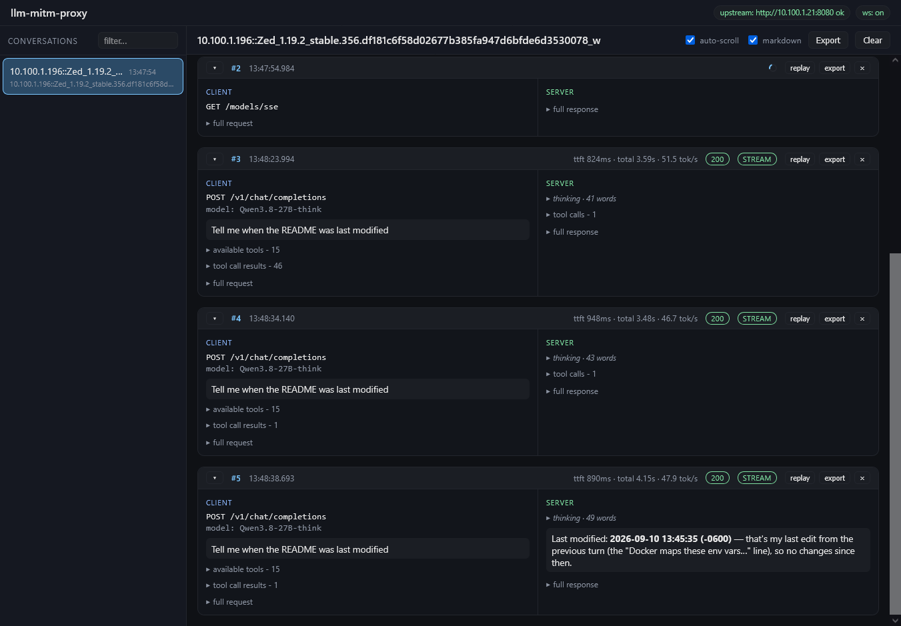

# llm-mitm-proxy
A simple transparent MITM proxy for LLM APIs with a live Web UI for inspecting, replaying, and exporting "conversations" between clients and an upstream server.

**Trusted networks or testing only**
There is no authentication, no SSL/TLS termination, or other "reverse proxy" feature set. Its primary intent is to provide visibility between an agent and the server.



## Client Identification
Clients are identified by their source IP, user agent, and API key (if provided), which determines which "conversation" traffic appears under in the Web UI. An API key is not required, IP and user agent are enough to tell many clients apart, but an API key can be used as a further split for clients sharing the same IP, and user agent.

## Vibe Warning
This project was entirely **vibe coded** with Qwen 3.8 27B and the Zed Agent on local hardware.

Work proceeded milestone by milestone according to the [PLAN.md](./docs/PLAN.md) with design, key decisions, and open questions. Occasional updates were made to the plan as direction shifted. Each milestone was tested against a llama.cpp server by a human before committed.

The full agent conversation log is preserved in [CONVERSATION.md](./docs/CONVERSATION.md).

## Quick Start
### Docker Compose
```yaml
services:
  llm-mitm-proxy:
    image: ghcr.io/mill1000/llm-mitm-proxy:latest
    restart: unless-stopped
    ports:
      - "8081:8081" # LLM API
      - "9090:9090" # Web UI
    environment:
      UPSTREAM_BASE_URL: "http://<your-llamacpp>:8080"
    extra_hosts:
      - "host.docker.internal:host-gateway"
```

### Docker
```bash
docker run -d --name llm-mitm-proxy -p 8081:8081 -p 9090:9090 -e UPSTREAM_BASE_URL=http://<your-llamacpp>:8080 ghcr.io/mill1000/llm-mitm-proxy:latest
```

## pipx/uvx
```bash
# uvx
uvx llm-mitm-proxy http://<your-llamacpp>:8080

# pipx
pipx install llm-mitm-proxy
llm-mitm-proxy http://<your-llamacpp>:8080
```

## Usage
1. Start the proxy
2. Point an agent at the proxy
3. Open the Web UI and look at the requests go brrr.

See [Configuration](#configuration) for more information on specifying an upstream API key, changing ports, and other options.

## Configuration
### Command Line
```
usage: llm-mitm-proxy [-h] [--version] [--host HOST] [--proxy-port PORT] [--web-port PORT]
                      [--upstream-api-key KEY] [--log-level LEVEL] [--ui-dir DIR]
                      [UPSTREAM_BASE_URL]
```

| Arg | Notes |
|---|---|
| `UPSTREAM_BASE_URL` (positional) | upstream base URL (default `http://host.docker.internal:8080`) |
| `--host` | listen host for both listeners (default `0.0.0.0`) |
| `--proxy-port` | proxy listener port (default `8081`, the transparent catch-all; llama.cpp's own default is `8080`) |
| `--web-port` | WebUI + `/api/*` + `/ws` + `/health` listener port (default `9090`) |
| `--upstream-api-key` | optional server-side fallback key, injected only when a client sends no key |
| `--log-level` | app loggers, incl. the `llm_proxy.ws` connection trace at `debug` (connect/focus/disconnect) |
| `--ui-dir` | static UI directory (default: the in-package `llm_proxy/web` build) |
| `--help` / `--version` | usage / package version |

### Docker Environment Variables

The Docker image maps the following environment variables to command line options:
| Var | CLI arg |
|---|---|
| `UPSTREAM_BASE_URL` | positional upstream |
| `UPSTREAM_API_KEY` | `--upstream-api-key` |
| `LISTEN_HOST` | `--host` |
| `PROXY_PORT` | `--proxy-port` |
| `WEB_PORT` | `--web-port` |
| `LOG_LEVEL` | `--log-level` |
