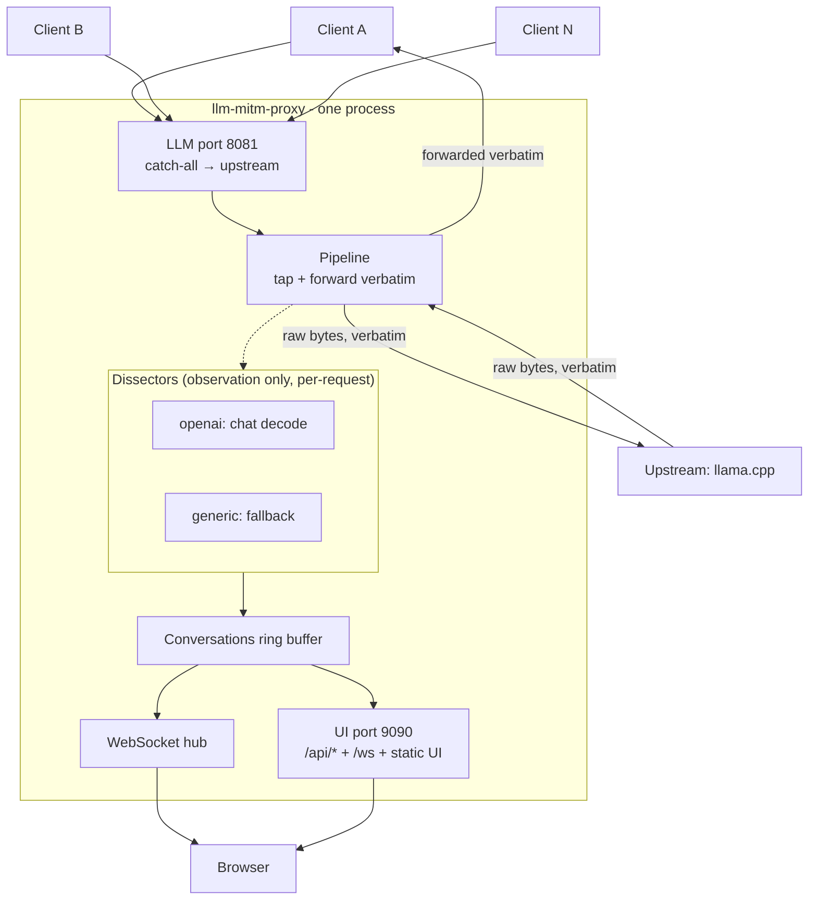
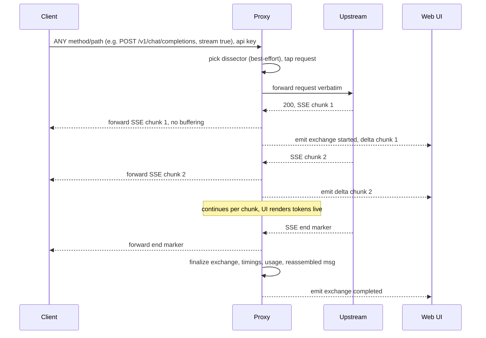

# llm-mitm-proxy — Build Plan

> A lightweight, low-overhead, **transparent MITM proxy for LLM APIs** with a live "conversation" Web UI for inspecting, replaying, and exporting client↔server traffic.
>
> Status: **M0–M6 implemented** (M6 awaiting commit); M7+ proposed in §14. All questions resolved — see §13.

---

## 1. Goals

1. **Transparently proxy every request** (any method, any path) from **multiple clients** to the LLM upstream — OpenAI-compatible, llama.cpp-native, or anything else. Best-effort capture & decode for the UI; undecodable traffic is still proxied and logged.
2. A **Web UI** showing live API transactions as a **conversation view** (prompt → response), with full debug info (raw headers, bodies, status, timings). Each message is **expandable** to show the entire wire call.
3. **Each client gets its own conversation tab** (left-hand dock lists clients/conversations; main pane shows the selected one).
4. **Replay** any captured request to the upstream and append the result to the conversation.
5. **Export** a conversation as a structured **JSON dump**.
6. Ship as a **Docker container, single image** (Dockerfile + example `docker-compose.yml`), with the **LLM proxy on its own port** (default 8081) and the **Web UI + app API on a separate port** (default 9090).
7. **Performant** — no significant added latency/overhead between client and server.
8. **Pluggable dissectors** (modules) that define how the pipeline *extracts/decodes* request & response data for the conversation view. Observation-only — the wire is always forwarded verbatim (cross-protocol translation is out of scope, §1 non-goals).
9. Show **timestamps and time deltas** (TTFT, total, inter-token) in the conversation view.

### Non-goals

- **Cross-protocol translation is out of scope, permanently** (e.g. OpenAI in → Anthropic out). The proxy is a transparent tap: dissectors *read* the traffic for the UI but never rewrite it. Clients and the upstream must speak a compatible API to each other.
- No TLS interception / certificate forging: "MITM" here is API-level — clients must be configured to point at the proxy's plain-HTTP port (see §10).
- Not a full feature-clone of any existing tool; it borrows the *vibe* (mitmproxy + Llama.cpp WebUI).

---

## 2. Key Decisions (with rationale)

| Decision | Choice | Rationale |
|---|---|---|
| Language / runtime | **Python 3.11–3.14 (3.14 in the image), async (`asyncio`)** | User's home language. Traffic is I/O-bound (LLM latency dominates), so async Python adds negligible overhead while keeping iteration fast. Avoids the dev-speed cost of Rust/Go for a tool where raw CPU is not the bottleneck. |
| HTTP framework | **FastAPI + Uvicorn** (Starlette core) | Async-native, serves the proxy, UI static files, REST, and WebSocket from one process, two ports. `uvloop` optional. |
| Upstream client | **`httpx2` (async, connection-pooled, HTTP/1.1 + keep-alive, streaming)** | First-class async streaming (`aiter_*`), connection reuse, clean timeout control. |
| Live UI transport | **WebSocket** (`/ws`) | One persistent, low-overhead channel for live token/exchange events. Better than polling; simpler than SSE for bidirectional (replay, selection) control. |
| Frontend | **No-build single-page app** (vanilla JS, optional Preact) served as static files | Keeps the Docker image **single-stage & small** (no Node build), trivially maintainable. (Q6 decided — see §13.1.) |
| Client identity | **`host::user-agent::key`** (parts sanitized; key optional) | Trusted LAN; zero-config. The user agent splits tabs per *application* (two apps on one machine get separate tabs); an optional key adds a third split. See §5.1 + the Docker source-IP note. |
| Streaming | **Tap-and-forward SSE** | Forward upstream SSE bytes to the client in real time (no full buffering) while tapping deltas to the UI. This is the core of both performance and the live view. |
| Ports | **Two listeners, one process:** LLM port (default **8081**, catch-all → upstream) and UI port (default **9090**: Web UI, `/api/*`, `/ws`, `/health`) | A truly transparent proxy must not reserve any path for its own routes; separate ports remove the collision entirely and keep the LLM port 100% passthrough. |
| Extraction model | **Dissector plugins** (observation-only, selected **per request**) | Each request is matched by (method, path): a matching dissector decodes it, everything else falls back to `generic` raw capture — no selection flag. The pipeline always forwards raw bytes verbatim. Replaces the old adapter/IR model — no translation, no in/out pairing (see §6). |
| Storage | **In-memory ring buffers** (+ optional on-disk JSON persistence) | Live tool first; persistence is opt-in. |
| Testing | **`python -m unittest`** (stdlib) — one framework, no runner deps | Zero extra dependencies, consistent with the lean/low-overhead ethos. The suite is small (a handful of e2e + unit tests) and unittest is sufficient; `python -m unittest discover` needs no runner config. Migrate to pytest only if the suite grows and needs fixtures/parametrize. |

---

## 3. Architecture

### 3.1 High-level diagram



Two listeners in one process (two uvicorn servers sharing the event loop, store, hub, and upstream client):

- **LLM port (8081)** — a catch-all route: *every* method and path is forwarded to the upstream. There are no reserved routes on this port, so the proxy can never 404 or shadow a client request.
- **UI port (9090)** — Web UI, `/api/*`, `/ws`, `/health`. Not proxied; not visible to LLM clients.

The tap (dotted arrows) sits on the pipeline's forward path: the request (once) and the response stream (per chunk) are passed to the **dissectors** (§6), which extract what the conversation view needs. Extraction is a side channel — it never delays or alters the bytes going to the client.

### 3.2 Components

- **LLM listener** — FastAPI app on the LLM port with a single catch-all route (`*` method, `/{path:path}`) → proxy pipeline. No other routes.
- **UI listener** — FastAPI app on the UI port: static UI, `/api/*` (conversations, exchanges, replay, export, client removal), `WS /ws`, `GET /health`.
- **Pipeline** — forwards the request **verbatim** (body/headers unchanged; hop-by-hop management; optional server-side key fallback) and streams the response back **verbatim, chunk by chunk**. On the way it taps both directions into the dissectors + store and records timings.
- **Dissectors** — observation-only extraction plugins (see §6): `openai` decodes `POST */chat/completions`; `generic` is the implicit fallback for everything else (raw capture + `INFO` log). Selection is **per request** by (method, path) — no selection flag — so every exchange is captured.
- **Store** — per-client conversation = bounded ring buffer of exchanges (configurable size/age). Thread-agnostic (single event loop → no locks needed on the hot path).
- **WebSocket hub** — fans out events (new exchange, token delta, replay, error) to subscribed UI clients.
- **UI** — single-page app: left dock (client/conversation list), main pane (conversation), transport over `/ws`.

### 3.3 Data flow (streaming, the important case)



Non-streaming responses follow the same pipeline minus the per-chunk fan-out (one `exchange_completed` with the full body).

---

## 4. Data Model

```
Client
  id          (sanitized "host::user-agent" + "::key" when a key is sent)
  name        (human label; auto or from key mapping)
  first_seen, last_seen

Conversation          (one per client by default; optionally auto-split by message history)
  id
  client_id        (as above)
  tag              ("" by default; set when auto-split opens a new conversation)
  created_at
  exchanges: [Exchange]   (ring buffer, bounded)

Exchange
  id
  sequence          (monotonic per conversation)
  is_replay
  dissector         ("generic" | "openai"; which dissector decoded this)
  client_request:   { timestamp, method, path, headers, body_json, size_bytes }
  server_response:  { timestamp, status, headers, body_json | {stream:true, chunks:[], reassembled}, size_bytes }
  timings:          { t_request_in, t_upstream_send, t_first_byte, t_first_content,
                      t_last_content, t_end, ttft_ms, total_ms, gen_tok_per_sec }
                      # gen_tok_per_sec: from upstream-reported timings (llama.cpp
                      # embeds predicted_n/predicted_ms); null when not available
  usage:            { prompt_tokens, completion_tokens, total_tokens }   (if upstream provides)
  error:            { type, message } | null
  in_flight:        bool   (true while the upstream call is still running)
  streaming:        bool   (request wanted a stream; shown on the pending card)

Event (WS payload)
  { type: exchange_started | delta | exchange_completed | replay | error | client_seen,
    conversation_id, exchange_id, ... }
  # delta events carry `delta` (content text) and `reasoning_delta` (thinking text
  # for reasoning models, e.g. llama.cpp --reasoning-preserve); either may be ""
```

**In-flight visibility:** when a request starts, an `in_flight` placeholder (client_request only) is registered in the ring buffer and finalized in place on completion, so REST always shows the conversation *while* requests run. This is load-bearing: `exchange_started` is focus-scoped and is lost to a UI that only now focuses the conversation, so without it a client's first long-running request would show an empty conversation until it completes.

**Splitting multiple conversations from one machine (no API key needed).** By default a client IP maps to a single conversation tab. If one machine runs more than one logical chat, conversations can be auto-split **without any key or client config** by detecting boundaries from the request's `messages` history (OpenAI chat is stateless — the client re-sends the full history each turn):
- A request **continues** the current conversation when its `messages` starts with the same first message **and** its length is ≥ the previous request's (history is being echoed back / grown).
- Otherwise it **starts a new conversation** (history reset or a different first message — a fresh chat or a one-shot prompt).
This is opt-in via `SPLIT_CONVERSATIONS=history` (**off by default** = one tab per IP). It's a heuristic: it cleanly groups multi-turn chats and separates fresh/one-shot prompts, but two *interleaved* apps on one IP can still be ambiguous. For explicit control, an optional `X-Conversation-Id` header (no key required) can force the `tag`.

**Retention:** per-client ring buffer capped by `RETENTION_MAX_EXCHANGES` and `RETENTION_MAX_AGE`. Eviction is lazy (on append) and cheap. Persistence is **in-memory only for now**; SQLite is a roadmap option (Q5).

---

## 5. API Surface

### 5.1 LLM API proxy (LLM port — client → proxy)
- **Catch-all:** *every* method and path on the LLM port is forwarded to the upstream. No allowlist, no reserved routes — the proxy can never 404 or shadow a client request (this is why the UI lives on a separate port, §3.1).
- **Client identification (drives the conversation tab):** `client_id` = sanitized `"<host>::<user-agent>"`, with the **API key** appended (`"::<key>"`) when the client sends one. **No key is required.** The user agent splits tabs per *application*; the optional key is an *identifier* (a third split), not a security credential.
- **Transparent forwarding:** the proxy forwards the request **body and headers unchanged** (it only rewrites what it must — routing/`Host` to reach the upstream, and connection/hop-by-hop management). The goal is a near-invisible hop: the upstream should not be able to tell it is behind the proxy.
- **Auth pass-through (the key point):** the client's `Authorization` / API-key header is **forwarded to the upstream as-is** — never rewritten or replaced. The client's auth relationship with the upstream is preserved end-to-end.
  - *Fallback only:* if the client sends **no** key and `UPSTREAM_API_KEY` is configured, the proxy injects that server-side key (convenience for upstreams that require a key while some clients omit one). If neither is present, no auth header is sent.
  - When a client does send a key, it also serves as the conversation-tab identifier (see above).
- **Traffic no dissector decodes:** requests that fall back to `generic` (§6) are still proxied verbatim, captured opaquely (method/path/status/size + raw body preview), and **logged** (`INFO`: `undecoded request: METHOD /path` from host). They appear in the conversation as ordinary exchange cards — the two-sided layout with raw body preview (Q16) — and support replay like any other exchange (Q18).

> **Client source IP under Docker.** On **Linux**, published ports are normally handled by **iptables DNAT**, which rewrites only the destination — so a service behind `ports:` **does see the real client source IP**. No special networking is required; plain `ports:` is sufficient for IP-based identification. Two caveats:
> - If your Docker daemon routes published ports through the **userland proxy** (`docker-proxy`) instead of DNAT, the source IP can appear as the bridge IP (e.g. `172.17.0.1`). Fix by disabling the userland proxy (daemon `userland-proxy: false`) or, if you prefer, using `network_mode: host`.
> - On **Docker Desktop (macOS/Windows)** the real client IP is not visible (you see the VM's NAT IP).
> In either degraded case, set `CLIENT_ID_HEADER` and have clients send it, or accept per-host IP granularity.
>
> **MAC address** is deliberately *not* the identity key: the HTTP/ASGI layer only exposes the IP, and MACs aren't reliable across switches/NAT. If MAC capture is ever wanted it's a best-effort OS-level enrichment, not the stable key.

### 5.2 UI REST API (UI port, `/api/...`)
- `GET  /api/clients` — list clients/conversations (for the dock).
- `GET  /api/conversations/{id}` — full conversation (paginated).
- `GET  /api/conversations/{id}/exchanges/{seq}` — one exchange (full debug).
- `POST /api/conversations/{id}/exchanges/{seq}/replay` — re-send the captured **client request** for exchange `{seq}` to the upstream (body: the full edited request body to send in place of the captured one; empty/absent = replay as-is). Returns/creates a new exchange flagged `is_replay`.
- `GET  /api/conversations/{id}/export?format=json` — download dump (§7).
- `DELETE /api/conversations/{id}` — clear a conversation.
- `DELETE /api/clients/{id}` — remove a client and all its conversations (it re-registers on its next request).

### 5.3 WebSocket protocol (UI port, `/ws`)
- Server → UI: JSON events from the `Event` model above.
- UI → server: `{ type: subscribe, conversation_id }`, `{ type: unsub }`, and (optional) control messages. Subscribing is scoped so a UI tab only gets traffic for the conversation it's viewing (plus a lightweight "new activity" ping for others).

---

## 6. Dissector Model

Dissectors are **observation-only** plugins: they define how the pipeline *extracts* request/response data for the conversation view. They never rewrite, translate, or gate the wire — every byte is forwarded verbatim whether or not a dissector matches. This replaces the old in/out adapter + IR model: extraction only, no translation (cross-protocol is out of scope, §1).

```python
# Raw wire objects (the "full debug info") — unchanged from before.
@dataclass
class WireRequest:
    method: str; path: str; headers: dict; body: bytes; body_json: dict | None
@dataclass
class WireResponse:
    status: int; headers: dict; body: bytes; body_json: dict | None
    streaming: bool = False

class Dissector(Protocol):
    name: str                                  # "generic" | "openai"
    def matches(self, method: str, path: str) -> bool: ...
    def request(self, wire: WireRequest) -> ParsedRequest: ...
    # Response lifecycle: start → feed chunks (streaming only) → finalize.
    def response_started(self, status: int, headers: dict) -> object: ...
    def feed_chunk(self, handle: object, chunk: bytes) -> list[Delta]: ...
    def finalize(self, handle: object) -> ParsedResponse: ...
```

- **`ParsedRequest`** — what the UI needs up front: `model`, `stream`, `preview` (one-line prompt), `messages` (chat dissectors only), `body_json`, `size_bytes`.
- **`ParsedResponse`** — `reassembled` (text), `reasoning`, `usage`, `timings` (when the upstream reports them, e.g. llama.cpp `predicted_n/predicted_ms`), `body_json`, raw.
- **`Delta`** — `{delta, reasoning_delta}` → the WS `delta` event that drives live rendering.

**Selection (per request):** for each proxied request, the pipeline tries the registered dissectors' `matches(method, path)`; the first match decodes it, otherwise the request falls back to `generic` (raw capture + `INFO` log). There is **no deployment-level selection flag** — the same client may send chat requests (decoded) and metadata pokes (opaque) in one conversation. `generic` matches everything, so every exchange has a dissector.

**Set (M6):**

| dissector | matches | extracts |
|---|---|---|
| `openai` | `POST */chat/completions` (Q21) | full chat decode: model, stream flag, messages, live streaming deltas (content + reasoning + tool calls), reassembled completion, usage, upstream timings |
| `generic` (fallback) | everything (implicit) | raw capture: method/path/status/size + raw body (JSON-pretty-printed when it parses, capped at N KB); no per-chunk parsing; `INFO` log per undecoded request |

(The earlier `llamacpp` level was dropped: llama.cpp speaks the OpenAI chat API, so the `openai` decoder covers it, and its metadata paths — `/props`, `/models/sse`, `/v1/models` — are deliberately *not* decoded, just captured opaquely.)

**Performance:** dissectors sit *off* the forward path (tap, §9). The `generic` fallback must stay cheap — no full body parse beyond a JSON sniff, capped raw capture; the `openai` decoder adds per-chunk work only for chat paths.

---

## 7. Conversation Dump / Export Format

Proposed JSON schema (versioned). Design goals: self-describing, replayable, and consumable by both humans and LLMs/tools (Q10: human / LLM inspection only).

```json
{
  "format": "llm-mitm-proxy/conversation",
  "version": 1,
  "exported_at": "2026-09-04T12:00:00Z",
  "proxy": {
    "version": "2026.09.04",
    "upstream": { "name": "llama.cpp", "base_url": "http://llamacpp:8080", "model": "local-model" }
  },
  "client": { "id": "client-a", "name": "my-app" },
  "stats": {
    "exchange_count": 42,
    "total_prompt_tokens": 12345,
    "total_completion_tokens": 6789,
    "avg_ttft_ms": 180,
    "avg_total_ms": 3200
  },
  "exchanges": [
    {
      "id": "ex-0001",
      "sequence": 1,
      "is_replay": false,
      "dissector": "openai",
      "client_request": {
        "timestamp": "2026-09-04T11:58:01.101Z",
        "method": "POST",
        "path": "/v1/chat/completions",
        "headers": { "authorization": "***", "content-type": "application/json", "...": "..." },
        "body": { "model": "local-model", "stream": true, "messages": [ {"role":"user","content":"hi"} ] },
        "size_bytes": 214
      },
      "server_response": {
        "timestamp_first_byte": "2026-09-04T11:58:01.281Z",
        "timestamp_end": "2026-09-04T11:58:02.900Z",
        "status": 200,
        "headers": { "content-type": "text/event-stream" },
        "streaming": true,
        "reassembled": { "choices": [ { "message": { "role": "assistant", "content": "Hello!" } } ] },
        "chunks": [ {"event":"data","data":"..."}, "..." ],
        "size_bytes": 512
      },
      "timings": {
        "t_request_in": "2026-09-04T11:58:01.100Z",
        "ttft_ms": 181,
        "total_ms": 1800,
        "tokens": 12,
        "tokens_per_sec": 6.6
      },
      "usage": { "prompt_tokens": 8, "completion_tokens": 12, "total_tokens": 20 },
      "error": null
    }
  ]
}
```

Notes:
- `chunks` for streaming is **optional** (`INCLUDE_RAW_CHUNKS=true`), since raw SSE can be large; `reassembled` is always present.
- Redaction: by default mask `authorization`/secret headers in dumps (configurable).
- Exchanges decoded only by the base carry `"dissector": "generic"`; their request/response sections hold the raw capture only (no `reassembled`/`usage`).
- A single exchange can also be exported in isolation for easy sharing.

---

## 8. Web UI Design

**Vibe:** mitmproxy (list on the left) + Llama.cpp WebUI (chat in the main pane). Single page, vanilla JS, minimal esbuild build (M8: bundle + minify into static `ui/dist/`).

```

+----------------+---------------------------------------------+
|  llm-mitm-proxy                   [Clients:3]  [Upstream:ok] |
+----------------+---------------------------------------------+
|  CLIENTS       |  client-a (my-app)        [Export][Clear][⏵]|
|  ▸ client-a    |+-------------------------------------------+|
|    client-b    |  #1  11:58:01.100 (Δ ttft 181ms · 1.8s)     |
|    client-c    |  ┌ CLIENT (left) ──────────────────────────┐|
|  + [filter]    |  │ POST /v1/chat/completions  model=local  │|
|                |  │ ▸ expand full request (headers+body)    │|
|                |  │ [Replay] re-send as-is (M4: dock edit)  │|
|                |  └─────────────────────────────────────────┘|
|                |  ┌ SERVER (right) ─────────────────────────┐|
|                |  │ 200  stream: true                       │|
|                |  │ ▸ thinking… (M4, collapsed) 123 tok     │|
|                |  │ Hello! Hello there! ... (live tokens)   │|
|                |  │ ▸ expand response (raw SSE + usage)     │|
|                |  └─────────────────────────────────────────┘|
|                |  #2  11:58:05.020  ...                      |
|                |+-------------------------------------------+|
|                |  REPLAY (M4) — collapsible, while editing   |
|                |  model=local  temp=0.7  msgs[1] [raw][Send] |
+----------------+---------------------------------------------+

```

Features:
- **Left dock:** live list of clients/conversations with a "new activity" pulse; click to select; optional search/filter.
- **Main pane:** chronological exchange list. Each exchange renders **client request on the left, server response on the right** (two-sided, like chat bubbles but wire-level).
- **Live:** streaming responses render token-by-token as they arrive over `/ws`; timing deltas update live (TTFT, running total, tok/s).
- **Thinking text:** the server card shows the model's reasoning block inline (v1); in **M4** it is collapsible to a one-line summary (see mockup).
- **Expand:** each side expands to the **full wire call** — method, path, headers, raw body, status, raw SSE/JSON, size, usage.
- **Undecoded exchanges:** traffic falling back to the `generic` base (§6) renders in the **same two-sided layout** as decoded exchanges — client method/path (model when sniffed) on the left, status + raw body preview on the right. No separate card shape and no dissector badge: the card content itself signals what was decoded.
- **Timestamps & deltas:** per-exchange absolute timestamp + TTFT, total, and per-token metrics.
- **Replay (on the client/request side):** a button on the captured request re-sends it to the upstream. The fresh result is appended as a **new exchange** flagged `is_replay` (so the original response is preserved for comparison). The button opens the **bottom-dock editor** (structured fields + raw JSON) pre-populated with that exchange's request; the dock re-sends the **full edited body** in place of the captured one (empty body = as-is) — see the dock in the mockup above.
- **Export:** per-conversation (and per-exchange) JSON download per §7.
- **Auto-follow:** an "auto-scroll" toggle for live conversations.

Implementation: static `index.html` + `app.js` + `styles.css` (vanilla or Preact), one `WebSocket` to `/ws`, REST for initial load / replay / export. No build tooling → trivially served by the same FastAPI process.

---

## 9. Performance Strategy

The overhead target is **near-zero added latency**, dominated by the model, not the proxy.

1. **Tap-and-forward streaming** — forward each upstream SSE chunk to the client as soon as it's read; never buffer the whole response before the client sees tokens. The UI tap is a side channel (async, non-blocking) and never blocks the client path.
2. **Single async event loop** (`asyncio` + `uvicorn`), **connection pooling + keep-alive** to upstream (`httpx2.AsyncClient` with a pool). No per-request process/socket churn.
3. **Lightweight per-chunk work** — the hot path only does: read chunk → write chunk → cheap SSE line parse (split on `\n`, prefix match `data:`). No heavy JSON parsing on every delta.
4. **Parse-once, reuse** — full JSON parse of request/response happens once (for IR/UI), not per token.
5. **Bounded memory** — ring buffers cap retention; raw SSE chunks are dropped from memory after reassembly (unless persistence is on).
6. **Optional `uvloop`** on Linux for extra loop throughput.
7. **Observability of overhead** — each exchange records `t_request_in`, upstream TTFT, and client-visible TTFT, so the proxy's own added latency is directly measurable in the UI/export.
8. **Backpressure** — `await` on client writes (async) provides natural backpressure; a per-exchange high-water mark guards a slow UI subscriber without stalling the client.
9. **Cheap fallback extraction** — the `generic` base does no per-chunk parsing and raw capture is capped, so non-chat traffic can't bloat memory or the hot path; deeper dissectors add per-chunk work only for the paths they extend.

**Sizing (confirmed, Q4):** up to ~10 clients, realistically 1–3, a few requests/second at most, with high per-request latency (LLM generation). This is exactly the profile where async Python is comfortably transparent — no Go/Rust needed.

---

## 10. Security

*Deployment context (confirmed): **internal / trusted network only. Authentication and TLS are not requirements.***

- **No client auth by default.** Clients connect with no key; identity comes from source IP (+ optional key as a tag). There is no `PROXY_API_KEYS` gate in the default path.
- **Optional client key** is purely an *identifier* (to split conversation tabs), not a security credential.
- **Upstream key:** client-supplied keys are **passed through unchanged** (transparent). `UPSTREAM_API_KEY` is only a server-side *fallback* injected when a client sends no key; it is never exposed to clients.
- **UI auth / TLS:** out of scope (trusted network). The only auth behavior is transparent pass-through of the client's key to the upstream (§5.1) — no proxy-side keys, no UI token.
- **Secrets in dumps:** mask `authorization`/secret headers in exports by default (cheap insurance even on a trusted net).
- **No arbitrary egress:** the proxy only talks to the single configured upstream.
- **Run as non-root** in the container.

---

## 11. Docker & Deployment

**Single image**, **one process with two listeners** — the LLM port (default **8081**) is the catch-all proxy; the UI port (default **9090**) serves the Web UI, `/api/*`, `/ws`, and `/health`. Two-stage alpine build (build stage → pipx runtime; see §12).

### `Dockerfile` (no-build UI variant)

```dockerfile
# syntax=docker/dockerfile:1
FROM python:3.12-slim AS runtime

ENV PYTHONDONTWRITEBYTECODE=1 \
    PYTHONUNBUFFERED=1 \
    PIP_NO_CACHE_DIR=1 \
    UI_DIR=/app/ui

WORKDIR /app

# Install the package (and its dependencies); pyproject.toml is the single
# source of truth for requirements.
COPY pyproject.toml README.md ./
COPY src ./src
RUN pip install --no-cache-dir .

# Static UI (served from UI_DIR).
COPY ui ./ui

# Non-root user.
RUN useradd -m appuser && chown -R appuser:appuser /app
USER appuser

EXPOSE 8081 9090

HEALTHCHECK --interval=30s --timeout=3s --start-period=5s \
  CMD python -c "import sys,urllib.request;urllib.request.urlopen('http://127.0.0.1:9090/health')" || sys.exit(1)

# Image CMD maps the container env vars onto the `llm-mitm-proxy` CLI
# (positional upstream + --host/--proxy-port/--web-port/...), starting
# one process with two listeners.
```

> Note: both listeners run in **one process / one event loop** (the WS hub + in-memory store are shared). Scale horizontally later via an external store if ever needed (not in v1).

### `docker-compose.yml` (example)

```yaml
services:
  llm-mitm-proxy:
    build: .
    image: llm-mitm-proxy:latest
    # Standard port publishing. On Linux this goes through iptables DNAT,
    # which preserves the real client source IP — so IP-based client
    # identification works out of the box (see the §5.1 note).
    ports:
      - "8081:8081"      # clients → LLM API (catch-all proxy)
      - "9090:9090"      # Web UI + app API, at http://<host>:9090/
    environment:
      LISTEN_HOST: "0.0.0.0"
      LLM_PORT: "8081"           # LLM API proxy port (8081: coexists with llama.cpp's default 8080)
      UI_PORT: "9090"            # Web UI + app API
      # llama.cpp runs on the Docker host; reach it via host-gateway (mapped below).
      # Use the host's LAN IP if you prefer.
      UPSTREAM_BASE_URL: "http://host.docker.internal:8080"
      UPSTREAM_API_KEY: "${UPSTREAM_API_KEY:-}"   # optional fallback, used only if a client sends no key
      LOG_LEVEL: "info"
    extra_hosts:
      - "host.docker.internal:host-gateway"   # lets the proxy (on the bridge) reach the host
    restart: unless-stopped

  # Optional: run llama.cpp in compose too. On the same compose network the
  # proxy can reach it by service name → set UPSTREAM_BASE_URL=http://llama.cpp:8080
  # (and drop the host.docker.internal mapping above).
  # llama.cpp:
  #   image: <your-llama.cpp-server-image>
  #   # volumes: models, etc.
  #   # command: --port 8080 ...

# volumes:
#   llm-mitm-proxy-data:
```

**Config:** the package reads **no env vars**. `llm-mitm-proxy` takes CLI options (positional upstream, `--host`, `--proxy-port`, `--web-port`, `--upstream-api-key`, `--log-level`, `--ui-dir`) over defaults, and the image `CMD` maps the container env vars (`UPSTREAM_BASE_URL`, `UPSTREAM_API_KEY`, `LISTEN_HOST`, `LLM_PORT`, `UI_PORT`, `LOG_LEVEL`) onto them. Settings not on the CLI (upstream timeouts, retention, capture, WS liveness, uvloop) are defaults-only — add a CLI option if one needs to be tunable.

**Build:** `docker compose build` / `docker build -t llm-mitm-proxy .`. Multi-arch (Q11) is free — no code changes: `docker buildx build --platform linux/amd64,linux/arm64 -t llm-mitm-proxy . --push`.

---

## 12. Tech Stack Summary

| Layer | Choice |
|---|---|
| Language | Python 3.11–3.14 (3.14 in the image/devcontainer) |
| Async | `asyncio` (+ optional `uvloop`) |
| Web framework | FastAPI + Uvicorn |
| HTTP client | `httpx2` (async, pooled, streaming) |
| Live UI | Native `WebSocket` + vanilla JS (no framework); minimal esbuild build (bundle + minify + inline `marked`) → in-package `llm_proxy/web` (wheel package data) |
| SSE parsing | small hand-rolled line parser (no heavy dep) |
| Config | pydantic `Settings` (CLI args; container env vars mapped by the image `CMD`) |
| Packaging | `pyproject.toml` + `pip` (PEP 621) |
| Container | `node:alpine` (UI build) + `python:3.14-alpine` (wheel) → `alpine` runtime (pipx, non-root, tini, healthcheck) |

---

## 13. Decisions

### 13.1 Resolved
| # | Question | Decision |
|---|---|---|
| Q1 | Primary upstream | **Local llama.cpp server, single upstream.** Upstream API key (if any) set via `UPSTREAM_API_KEY` env / compose; never required of clients. |
| Q2 | Streaming emphasis | **Confirmed — nothing to do.** `stream: true` is the dominant case; live token rendering is already built (M1). |
| Q3 | Client identity | **Source IP (primary) + optional API key as a secondary tag.** No key required by default. MAC not used as the key (see §5.1 note). |
| Q4 | Scale | **≤10 clients, realistically 1–3, a few req/s max.** Async Python is plenty. |
| Q5 | Retention & persistence | **In-memory (live) only for now.** SQLite as a future option (roadmap). |
| Q6 | Frontend | **Vanilla JS** single-page app (no framework). M8 adds a **minimal esbuild build** (bundle + minify + inline `marked` from npm) — still no dev server, no HMR, no framework; `ui/dist` is pre-built at dev/docker-build time and served statically (zero per-request cost). |
| Q7 | Proxy auth | **None by default** (trusted network). Optional key is an identifier, not a credential. |
| Q8 | Exposure | **Internal / trusted network only.** No TLS/auth required. |
| Q10 | Dump consumers | **Human / LLM inspection only** — no specific ingest tool; the §7 format stays self-describing JSON. |
| Q11 | Container arch | **Multi-arch is free:** the alpine two-stage Dockerfile has no arch-specific steps, so `docker buildx build --platform linux/amd64,linux/arm64` produces both from the same Dockerfile — no code work. User tests arm64 later. |
| Q12 | Observability extras | **None** — text logs only (JSON log format dropped). |
| Q13 | Conversation granularity | **One tab per client by default** (`host::user-agent`, §5.1). Optional no-key auto-split via `SPLIT_CONVERSATIONS=history` (message-history boundary detection) or an `X-Conversation-Id` header to force a tag (see §4). |
| Q14 | Cross-protocol translation | **Out of scope, permanently.** Dissectors are observation-only (§6). |
| Q15 | Port layout | **Two ports:** LLM 8081 (catch-all proxy), UI 9090 (Web UI + /api/* + /ws + /health). One process, two listeners. 8081 chosen so the proxy can sit next to a default-config llama.cpp (8080). |
| Q16 | Opaque (undecoded) traffic in the conversation view | **Show** it in the ordinary two-sided exchange card (raw body preview; no separate card shape, no dissector badge) + `INFO` log line. |
| Q17 | Initial dissector set | **`openai` + `generic` fallback**, selected **per request** by (method, path) — no `--dissector` flag, no hierarchy (llama.cpp speaks the OpenAI chat API, so one chat decoder covers it; metadata paths are captured opaquely). No Anthropic dissector. |
| Q18 | Replay on opaque exchanges | **Yes** — replay works for every captured exchange, including opaque ones (re-issue the captured request). |
| Q19 | Persistence | **Future idea, not a milestone.** Stays in the §14 future-ideas list (SQLite or JSON under `PROXY_DATA_DIR`). |
| Q20 | Test restructure timing | **M7**, after M5+M6. |
| Q21 | `openai` dissector match scope | **`POST */chat/completions` only** (both `/v1/chat/completions` and bare `/chat/completions`) — no legacy `/v1/completions`; unmatched requests fall back to `generic` (§6). |
| Q22 | `marked` source | **npm `marked` bundled into `app.js` by esbuild** (replaces the vendored `marked.min.js`, which is deleted). The output bundle stays self-contained/offline — the original "go vendored" intent, but version-pinned via `package.json`. |
| Q23 | UI modularization | **None — `app.js` stays a monolith.** The build only bundles/minifies/inlines; no source split. Revisit if the file outgrows ~2k lines. |
| Q24 | PyPI distribution | **Yes — the wheel is the full app.** `npm run build` outputs into the package (`llm_proxy/web/`), shipped as explicit package data; a `pip install llm-mitm-proxy` (or `pipx`) copy serves the WebUI with no extra files. Release process: build the UI before the wheel. The Docker runtime inherits this (no separate UI copy). |

---

## 14. Milestones / Phased Delivery

**M0 — Skeleton (foundation)**
- Project layout, `pyproject.toml`, config (env), FastAPI app + `/health`.
- Proxy passthrough for `POST /v1/chat/completions` (non-streaming) → upstream, with `httpx2` pooling.
- Minimal capture: record request/response into an in-memory store.
- Dockerfile + compose that run it. *Exit: a client can call through the proxy; a dump endpoint returns the captured exchange.*

**M1 — Streaming + live UI (the core experience)**
- Streaming tap-and-forward (SSE) with per-chunk UI fan-out over `/ws`.
- Web UI v1: left dock (clients), main pane (conversation), live token rendering, timestamps + deltas, expand full request/response.
- Per-client conversation tabs; ring-buffer retention.
- *Exit: watch a streaming conversation render live, side-by-side, with correct TTFT/total/tok-s.*

**M2 — Replay + Export**
- Replay endpoint (full edited request body via the API body; empty = as-is) + UI button, flagged as replay.
- JSON dump (§7) for conversation and single exchange; secret redaction.
- *Exit: replay a captured prompt and download a full, replayable JSON dump.*

**M3 — Adapter seams + hardening**
- Formalize In/Out adapter protocols + registry; config-driven `IN_ADAPTER`/`OUT_ADAPTER`.
- Error handling, timeouts, backpressure, slow-client guards, structured logs.
- **Non-root image (high priority)**; multi-arch build (amd64 + arm64); healthcheck.
  No auth work — trusted network; the only auth behavior is transparent pass-through of the client's key to the upstream (§5.1).
- *Exit: clean plugin surface; stable under concurrent streaming clients; non-root, multi-arch image.*

**M4 — Polish**
- Fully customizable replay message in the WebUI: edit the captured request (model, params, messages) before re-sending, via the §5.2 replay endpoint (full edited body replaces the captured one; empty = as-is).
  - *Design: replay editor lives in a **collapsible dock at the bottom of the conversation pane** (right column only — does not span the left dock). The Replay button on a captured request opens the dock pre-populated with that exchange's wire request (model, params, messages); the dock holds the **Send** (and **Cancel**) actions. The conversation list stays above the dock; the dock only occupies space while open.*
  - *Editor granularity: **structured fields** (model, params) mirroring a **raw JSON body** that is the source of truth; clearing a field removes the key from the body.*
- **Collapsible thinking text:** the server card's reasoning/thinking block is collapsible to a one-line summary (e.g. `▸ thinking… 123 tok · 2.1s`); click to expand the full text. Live updates continue while collapsed. Suggested default: expanded while streaming, auto-collapse once thinking completes.
- (Additional polish items to be added as requested.)
- *Exit: a captured request can be fully customized and re-sent from the UI, with the result appended as a replay.*

**M5 — Transparent MITM core (two-port)**
- Split the app into **two listeners in one process** (two uvicorn servers, shared loop/store/hub/upstream client): LLM port (default 8081) = catch-all, every method/path → upstream, no reserved routes; UI port (default 9090) = UI + `/api/*` + `/ws` + `/health`.
- Pipeline forwards **everything** verbatim (non-SSE, non-JSON, error responses included) and taps every exchange into the store (raw capture, capped).
- Traffic decoded only by the `generic` base: logged (`debug`) + captured opaquely (raw body preview).
- CLI: `--proxy-port` / `--web-port` (replace `--port`); Dockerfile + compose publish both ports; healthcheck on the web port.
- *Exit: any client (e.g. Zed) works through the proxy with zero 404s; `/props`, `/models/sse`, and any other path appear in the UI as captured exchanges; the UI port behaves exactly as today.*

**M6 — Per-request decode**
- `adapters/` → `dissectors/`: base protocol (`matches`/`request`/response lifecycle) + registry; selection is **per request** by (method, path) — no `--dissector` flag, no hierarchy (§6).
- Chat-completions decode lives in the `openai` dissector (matches `POST */chat/completions`); `generic` is the implicit fallback (raw capture + `debug` log). The earlier `llamacpp` level was dropped — llama.cpp speaks the OpenAI chat API, and its metadata paths are deliberately left opaque.
- `/health` is **reachability-only** (any HTTP response from the upstream = `ok`), since a non-OpenAI upstream may not serve `/v1/models`.
- SSE reassembly merges `delta.tool_calls` fragments; the UI shows tool calls (name + arguments) on the server card.
- *Exit: chat decodes fully (content, thinking, tool calls); every other request is captured opaquely and logged; nothing ever 404s at the proxy.*

**M7 — Test restructure**
- Reorganize `tests/` by subject, not milestone: `test_store.py`, `test_proxy.py` (forwarding/streaming/timings/client-id), `test_dissectors.py`, `test_ui_api.py`, `test_ws.py`, `test_cli.py` (keep `mock_upstream.py`).
- Same coverage and suite-time target as today (~11s, bounded waits).
- *Exit: suite organized by subject; fully green.*

**M8 — Minimal frontend build (esbuild)**
- Introduce the smallest possible build step: **esbuild** (single static binary, no config file, one-line CLI per entry) bundles `ui/app.js` (kept a **monolith — no source split**, Q23) + `ui/styles.css` into minified outputs **inside the package at `llm_proxy/web/`**; `index.html` + `favicon.svg` are copied alongside. The directory is gitignored and shipped in the wheel as explicit package data (Q24).
- `marked` moves from the vendored `marked.min.js` (deleted) to the **npm `marked`**, inlined into the bundle by esbuild (Q22); `app.js` call sites updated to the npm API; `index.html` drops the marked `<script>` tag and serves the bundle as `<script type="module">` (build uses `--format=esm`).
- npm scripts: `build`, `watch` (rebuild on save, ~50ms — FastAPI keeps serving; **no dev server, no HMR**), `verify:js` unchanged (syntax check + eslint on the sources). `llm_proxy/_ui/` is gitignored; `package-lock.json` is now **committed** (Docker `npm ci` requires it).
- App change: `_ui_dir` default becomes the in-package `llm_proxy/web` (served from site-packages in wheel/pipx installs, from the source tree in editable dev); if absent → startup **warning** + UI mount skipped (the LLM proxy keeps working headless; `--ui-dir` still overrides).
- Dockerfile: new `node:alpine` stage (`npm ci && npm run build`) builds the UI into the package; the backend stage copies `llm_proxy/web` into the wheel build tree, so the **runtime stage needs no UI copy and `CMD` drops `--ui-dir /app/ui`** (non-root/tini/healthcheck unchanged). Devcontainer `postCreateCommand` gains `npm run build`.
- Tests: `TestUiServing` asset assertions **skip when the in-package `web/` is absent** (suite stays runnable without node); `TestPackaging` gains an assertion that the four UI assets exist inside the installed package.
- *Rationale: the build is a one-time offline step (dev saves + docker/release build); at request time the server still just serves static files — zero per-request cost, hot path untouched.*
- *Exit: `npm run build && npm run verify:js` clean; unit suite green with and without the built UI; docker image builds and UI behavior is unchanged vs. the live instance; a built wheel unpacks with `llm_proxy/web/` present; minified `app.js` materially smaller than the current 37KB source.*
- *Rationale: the build is a one-time offline step (dev saves + docker build); at request time the server still just serves static files — zero per-request cost, hot path untouched.*
- *Exit: `npm run build && npm run verify:js` clean; unit suite green with and without `dist/`; docker image builds and UI behavior is unchanged vs. the live instance; minified `app.js` materially smaller than the current 37KB source.*

**Future ideas (not milestones)**
- On-disk persistence (SQLite or JSON under `PROXY_DATA_DIR`) — Q19.
- Additional dissectors (e.g. Anthropic, Ollama-native) if real clients need them — Q17.


---

## 15. Risks & Mitigations

| Risk | Impact | Mitigation |
|---|---|---|
| Proxy adds noticeable latency | Violates perf goal | Tap-and-forward, pooling, light per-chunk path; measure added latency per exchange in UI/export. |
| SSE edge cases (multi-line `data:`, comments, `[DONE]`, keep-alive) | Malformed UI / stuck streams | Small, well-tested SSE line parser; treat unknown frames as passthrough. |
| Memory growth from long/streaming conversations | OOM | Ring buffers; drop raw chunks after reassembly; high-water marks. |
| Slow UI subscriber stalls client | Client latency | UI fan-out is a separate async task with backpressure/timeout; never blocks the client write path. |
| Opaque traffic pollutes the conversation view | Noise in dock/main pane | Standard two-sided cards keep them scannable; per-conversation filter; log-only alternative (Q16). |
| Two listeners complicate startup/deployment | Confusion about which port serves what | One process, two uvicorn servers on one loop; compose publishes both with comments; healthcheck on the UI port. |
| UI complexity without a build step | Maintains-ability | Keep JS small/structured; optional Preact; no framework churn. |

---

## 16. Proposed Repo Layout

```
llm-proxy/
├── PLAN.md
├── README.md
├── pyproject.toml
├── Dockerfile
├── docker-compose.yml
├── .dockerignore
├── llm_proxy/
│   ├── __init__.py
│   ├── app.py                 # app factory: two listeners (LLM catch-all + UI), WS endpoint, CLI
│   ├── config.py              # settings (CLI-driven; no env reads)
│   ├── proxy/
│   │   ├── router.py          # LLM-port catch-all route
│   │   ├── pipeline.py        # tap + forward verbatim, timing capture
│   │   └── sse.py             # SSE line parser + chunk tap
│   ├── dissectors/
│   │   ├── base.py            # Dissector protocol + registry
│   │   ├── generic.py         # raw capture, implicit fallback (+ log)
│   │   └── openai.py          # POST */chat/completions decode (chat, thinking, tool calls)
│   ├── model/
│   │   ├── ir.py              # wire/parsed types
│   │   └── conversation.py    # Client/Conversation/Exchange, ring buffer
│   ├── store/
│   │   └── memory.py          # in-memory store + retention
│   ├── hub.py                 # WebSocket hub
│   ├── api/
│   │   └── ui.py              # /api/* endpoints
│   ├── dump.py                # JSON export
│   ├── tests/                 # unittest suite (excluded from the wheel)
│   └── web/                   # gitignored esbuild output; wheel package data (Q24)
├── package.json               # build + lint tooling (esbuild, marked, eslint)
├── package-lock.json          # committed (npm ci in the Dockerfile)
└── ui/
    ├── index.html             # source (copied into llm_proxy/web at build)
    ├── app.js                 # source monolith (Q23); bundles marked from npm
    └── styles.css
```
